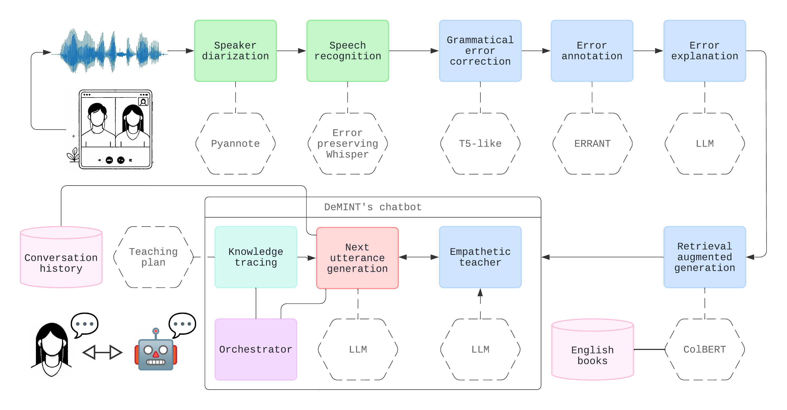

# DeMINT: Automated Language Debriefing for English Learners via AI Chatbot Analysis of Meeting Transcripts

## Project overview

This is the repository for DeMINT's chatbot code and auxiliary scripts.

DeMINT ("Automated Language Debriefing for English Learners via AI Chatbot Analysis of Meeting Transcripts") is a project funded by the EU's [UTTER](https://he-utter.eu/) project (grant agreement number 101070631) via a cascaded funding [call](https://ec.europa.eu/info/funding-tenders/opportunities/portal/screen/opportunities/competitive-calls-cs/3722). DeMINT was one of 8 projects selected out of 54 submissions. The project runs from January 15, 2024, to October 15, 2024. The resulting chatbot is also called `DeMINT`.

DeMINT's architecture was presented at UTTER 2nd User Day, an online event held on July 5, 2024. The [video](https://www.youtube.com/watch?v=TzEK9JlxVH4) of the presentation is available online. The project is being executed by the Transducens research group at Universitat d'Alacant, Spain. 

## Project goals

DeMINT aims to develop a conversational system that helps non-native English speakers improve their language skills by analyzing transcripts of video conferences in which they have participated. The system integrates cutting-edge techniques in conversational AI, including:

- Pre-trained large language models (LLMs)
- In-context learning
- External non-parametric memory retrieval
- Efficient parameter fine-tuning
- Grammatical error correction
- Error-preserving speech synthesis

The project culminated in a pilot study to assess the system’s effectiveness among L2-English learners.



## System description and how to cite this work

The paper "[DeMINT](https://aclanthology.org/volumes/2024.nlp4call-1/): Automated Language Debriefing for English Learners via AI Chatbot Analysis of Meeting Transcripts" presented at NLP4CALL 2024 thoroughly describes the system's architecture. If you use DeMINT in your research, please cite it as follows:

```bibtex
@inproceedings{demint2024,
  author = {Pérez-Ortiz, Juan Antonio and 
    Esplà-Gomis, Miquel and 
    Sánchez-Cartagena, Víctor M. and 
    Sánchez-Martínez, Felipe and 
    Chernysh, Roman and 
    Mora-Rodríguez, Gabriel and 
    Berezhnoy, Lev},
  title = {{DeMINT}: Automated Language Debriefing for English Learners via {AI} 
           Chatbot Analysis of Meeting Transcripts},
  booktitle = {Proceedings of the 13th Workshop on NLP for Computer Assisted Language Learning},
  month = october,
  year = {2024},
  url = {https://aclanthology.org/volumes/2024.nlp4call-1/},
}
```

## Project-derived datasets and models

In addition to the code in this repository, the project has released a series of additional resources in the form of datasets and models, which are listed below:

- English Learners Role-Playing Dialogue Dataset ([ELRD](https://github.com/transducens/elrd)). A dataset composed of audio extracted from role-playing video calls recorded with L2-English students. The repository also includes transcriptions and the role-playing activities that were assigned to the students.
- Error-preserving Whisper-based speech-to-text models. These speech-to-text models are fine-tuned to preserve grammatical errors in speech for error analysis. They are available in two versions: one based on an [original](https://huggingface.co/Transducens/error-preserving-whisper) Whisper model and another based on a [distilled](https://huggingface.co/Transducens/error-preserving-whisper-distilled) Whisper model.
- Synthesized English Speech with Grammatical Errors Dataset ([SESGE](https://huggingface.co/datasets/Transducens/sesge)). A dataset containing English speech with grammatical errors, along with the corresponding transcriptions. Utterances are synthesized using a text-to-speech model, whereas the grammatically incorrect texts come from the [C4_200M](https://aclanthology.org/2021.bea-1.4) synthetic dataset.
- Empathetic teacher model. A [model](https://huggingface.co/Transducens/empathetic-teacher) fine-tuned to simulate an empathetic teacher in conversations with students.


## Installation and setup

Clone the project repository:

```bash
git clone https://github.com/transducens/demint.git
cd demint
```

Install `Miniconda` following [the official tutorial](https://conda.io/projects/conda/en/latest/user-guide/install/index.html).
Then create the conda environment and install dependencies:

```bash
conda env create -f environment.yml
conda activate DeMINT
pip install -r requirements.txt
```

Finally, set up HuggingFace. To use models from the HuggingFace hub, log in using the CLI:

```bash
huggingface-cli login
```

When prompted, enter your HuggingFace API token. You can find or [generate this token](https://huggingface.co/docs/hub/security-tokens#how-to-manage-user-access-tokens) in the settings section of your HuggingFace account.

Additionally, you may need to request access to use the following gated models:

- [pyannote/speaker-diarization-3.1](https://huggingface.co/pyannote/speaker-diarization-3.1)
- [pyannote/segmentation-3.0](https://hf.co/pyannote/segmentation-3.0)
- [openai/whisper-large-v3](https://huggingface.co/openai/whisper-large-v3)
- [meta-llama/Meta-Llama-3.1-8B-Instruct](https://huggingface.co/meta-llama/Meta-Llama-3.1-8B-Instruct)

If you wish to use any other models from HuggingFace, you may also need to accept their respective user conditions.

## Running the data pre-processing pipeline

Go to the root directory `demint`. There are two options to run the prep-processing pipeline: via a single script or by running each step individually. The former is recommended for simplicity. Detailed instructions for the step-by-step process are provided [below](#optional-step-by-step-data-pre-processing). 

In order to process all the videos through the pipeline with a single command, you need to have the videos in the `assets/videos` directory. Then, run the following:

```bash
bash run_pipeline.sh
```

## Running the chatbot

In order to run the chatbot application, you need to set the OpenAI API key as an environment variable:

```bash
export OPENAI_API_KEY="my_chatgpt_key_goes_here"
```

Then, run the chatbot application:

```bash
python user_app.py [-h] [-l] [--conver CONVER] [--speaker SPEAKER] \ 
  [--port PORT] [--no_log] [--port_kind_teacher PORT_KIND_TEACHER] \
  [--address_kind_teacher ADDRESS_KIND_TEACHER]
```

The arguments are as follows:

- `-h`, `--help`: Show this help message and exit.
- `-l`, `--list`: List all the available conversations.
- `--conver CONVER`: The transcribed conversation to display. Default is `diarization_result`.
- `--speaker SPEAKER`: The speaker to display in the transcript. Default is `All speakers`.
- `--port PORT`: The port on which the server will run. Default is `8000`.
- `--no_log`: If this flag is set, the chatbot conversation logs will not be saved. Default is `False`.
- `--port_kind_teacher PORT_KIND_TEACHER`: The port on which the kind teacher will run. Default is `8000`.
- `--address_kind_teacher ADDRESS_KIND_TEACHER`: The address at which the kind teacher will run. Default is `localhost`.

Gradio will automatically open the application in your default web browser. If it does not, a local URL will be provided in the terminal output.

### Running the empathetic teacher server (optional)

Running the empathetic teacher server is optional. If the server is not running when the chatbot is executed, the chatbot will not use the empathetic teacher. In order to use the empathetic teacher in the chatbot, follow these steps.

First, create a new conda environment and install the dependencies:

```bash
cd kind_teacher_server
conda env create -f environment.yml
conda activate llamafactory_env
bash init.sh
```

Now, you can set the parameters for the API server:

```bash
export KIND_TEACHER_PORT=8000
export KIND_TEACHER_HOST="localhost"
```

Port and address of the server can be modified manually in `kind_teacher_server/src/llamafactory/api/app.py`. 

Finally, run the server:

```bash
cd kind_teacher_server
[CUDA_VISIBLE_DEVICES=0] llamafactory-cli api run_api_inference_1.yaml
```

### Cache files

Fot the correct execution of the chatbot application, the JSON files in `cache/rag_sentences` and `cache/raw_sorted_sentence_collection` are required. It is also necessary that the conversation to be used in the chatbot has the same name in both directories.

The cache files can be cleaned using the script `clean_cache.sh`.

## Step-by-step data pre-processing (optional)

These steps are optional. If you have already run the pipeline using the `run_pipeline.sh` script, you can skip this section. Run each program with the `-h` flag to see the available options.

**Download videos from YouTube**

In case you want to work with videos from YouTube, a script is provided to download a video in the `assets/videos` directory. 

```bash
python -m app.video_downloader [-h] -u URL [-n NAME]
```

You may also obtain the audio directly from YouTube in the `assets/audios` directory using the following command:

```bash 
python -m app.audio_downloader [-h] -u URL [-n NAME]
```

**Extract audio**

This extracts the audio from a video file (by default from `assets/videos`) and stores the audio (by default in `assets/audios`) with the same name, 16Hz of sample rate and mono audio.

```bash
python -m app.extract_audio [-h] [-vf VIDEO_FILE] [-af AUDIO_FILE] \
  [-vd VIDEO_DIRECTORY] [-ad AUDIO_DIRECTORY]
```

**Diarize audio**

This diarizes the audio (by default from `assets/audios`) and stores the resulting segments in a directory (by default in `cache/diarized_audios`) with the same name, 16Hz of sample rate and mono audio.

The first number of each segment is the index and the second number is the speaker ID.

```bash
python -m app.diarize_audio [-h] [-af AUDIO_FILE] [-ad AUDIO_DIRECTORY] [-sd SEGMENTS_DIRECTORY]
```

**Transcribe audio**

This transcribes the diarized audio (by default from `cache/diarized_audios`) and stores the resulting transcription (by default in `cache/diarized_transcripts`) with the same name in JSON format.

```bash
python -m app.whisper_speech [-h] [-ad AUDIO_DIRECTORY] [-tf TRANSCRIPT_FILE] \
  [-aad ALL_AUDIOS_DIRECTORY] [-td TRANSCRIPT_DIRECTORY]
```

**Prepare sentences collection**

This extracts the sentences, sorts them (by default from `cache/diarized_transcripts`) and stores the result (by default in `cache/raw_sorted_sentence_collecion`) with the same name in JSON format.

```bash
python -m app.prepare_sentences [-h] [-tf TRANSCRIPT_FILE] [-sf SENTENCES_FILE] \
  [-td TRANSCRIPT_DIRECTORY] [-sd SENTENCES_DIRECTORY]
```

**Obtain ERRANT errors**

This extracts grammatical errors (by default from `cache/raw_sorted_sentence_collection`) and stores the sentences with errors (by default in `cache/errant_all_evaluation`) with the same name in JSON format.

```bash
python -m app.obtain_errors [-h] [-sf SENTENCES_FILE] [-ef ERRANT_FILE] \
  [-sd SENTENCES_DIRECTORY] [-ed ERRANT_DIRECTORY]
```

**Explain errors**

Using an LLM (by default Llama 3.1-8B-Instruct), this explains all errors with more detail (by default from `cache/errant_all_evaluation/` ) and stores the explanations (by default in `cache/explained_sentences`) with the same name in JSON format.

```bash
python -m app.explain_sentences [-h] [-ef ERRANT_FILE] [-xf EXPLAINED_FILE] \
  [-ed ERRANT_DIRECTORY] [-xd EXPLAINED_DIRECTORY]
```

**Prepare RAG indexes**

Retrieval Augmented Generation (RAG) indexation is typically handled automatically during the `app/rag_sentences` stage of the data pre-processing pipeline. However, you can also perform indexation manually beforehand. This allows the pipeline to use pre-generated indexes, rather than extracting them during runtime.

1. Copy the pdf files you want to use for RAG in the `pdf_rag` folder.

2. Execute the `app/rag/RAGFactory` module. Internally, this module relies on:
    - `app/rag/content_extractor` to extract text content from all PDF files stored in the `pdf_rag` folder.
    - `app/rag/rag_ragatouille` to create indexes, which are saved in the folder `app/.ragatouille/colbert/indexes/tutor`.

For the indexation process, the model [colbert-ir/colbertv2.0](https://huggingface.co/colbert-ir/colbertv2.0) is used in conjunction with the tool [RAGatouille](https://github.com/AnswerDotAI/RAGatouille).


**Get RAG data about the sentences**

This indexes RAG data related to the extracted errors (by default from `cache/explained_sentences`) and stores all the information (by default in `cache/rag_sentences`) with the same name in JSON format.

```bash
python -m app.rag_sentences [-h] [-xf EXPLAINED_FILE] [-rf RAG_FILE] [-xd EXPLAINED_DIRECTORY] [-rd RAG_DIRECTORY]
```

## Usage

To list all available conversations along with their respective speakers, use the following command:

```bash
python user_app.py -l
```

When you run this, you should see an output similar to the following:

```bash
Available conversations and speakers:
- meeting-dm01-dm02
  - All speakers
  - SPEAKER_00
  - SPEAKER_01

- meeting-dm01-dm07
  - All speakers
  - SPEAKER_00
  - SPEAKER_01
```

If you'd like to start the chatbot for a specific conversation, you can do so by executing the following command:

```bash
python user_app.py --speaker SPEAKER_00 --conver meeting-dm01-dm02
```

And for more help, you can run the following command:

```bash
python user_app.py -h
```

## Documents

- There was a data management plan addressing issues such as data collection, data generation, data sharing, property rights and privacy, and long-term preservation and re-use, in compliance with national and EU legislation.
- There was a consent form in Catalan to be signed by the participants in the human evaluation. It was approved by the university's ethics committee.
  

